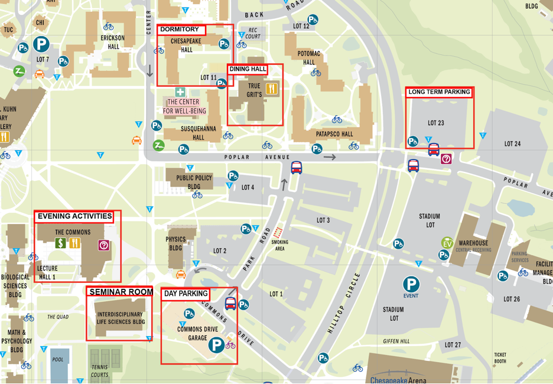

# Event Logistics

## Wireless

* WiFi: UMBC Visitor
* Username: not needed
* Password: not needed

## Location

* Lectures and tutorials will occur in the Interdisciplinary Life Sciences Building (ILSB) Rooms 116A and 237.
* Doors open at 8:00 am each morning (Sunday-Thursday). We will start the morning
  sessions at 8:30 am sharp.
* Due to space limitations, only registered hackweek participants will be allowed
  to attend the lectures, tutorials, and open working sessions.
* Participants are expected to attend all scheduled activities. Contact
  [anna.windledipaola@nasa.gov](mailto://anna.windledipaola@nasa.gov) if any circumstances prevent you from attending.

## Dorms

* Dorms are all single rooms with a shared bathroom. 
* Participants who opt to will be staying at Chesapeake Hall.
* Dorm check-in will be from 9am to 5pm on Saturday, August 3rd.
* Dorm check-out will be from 9am to 12pm on Friday, August 9th.
* There is a 24 hour desk in the lobby of the dorm. If you are arriving after 5pm on Saturday, check in at the 24 hour desk. 

## Meals

* Breakfast, lunch, and dinner will be provided each day through the meal cards that will
  be given to you when you check in to the dorms.
* Your meal card is programmed with the prearranged meals,
  which can be used at UMBC's True Grits dining hall. Please note that this is the
  only dining location on campus that the card will work for.
* Breakfast is available in the dining facility from 7:30am – 9:00am, lunch is available from 11:30am – 1:00pm,
  and dinner is available from 5:00pm - 6:30pm.
* If you are staying at a hotel or commuting, you will receive a meal card on Sunday morning in the ILSB building.
* Coffee and snacks will be provided each day in the ILSB building. 

## Travel

* UMBC MARC bus schedule: https://transit.umbc.edu/schedules/bwi-marc-line-schedule/
* Taxis and uber/lyft are available from nearby airports.

## Campus Map

