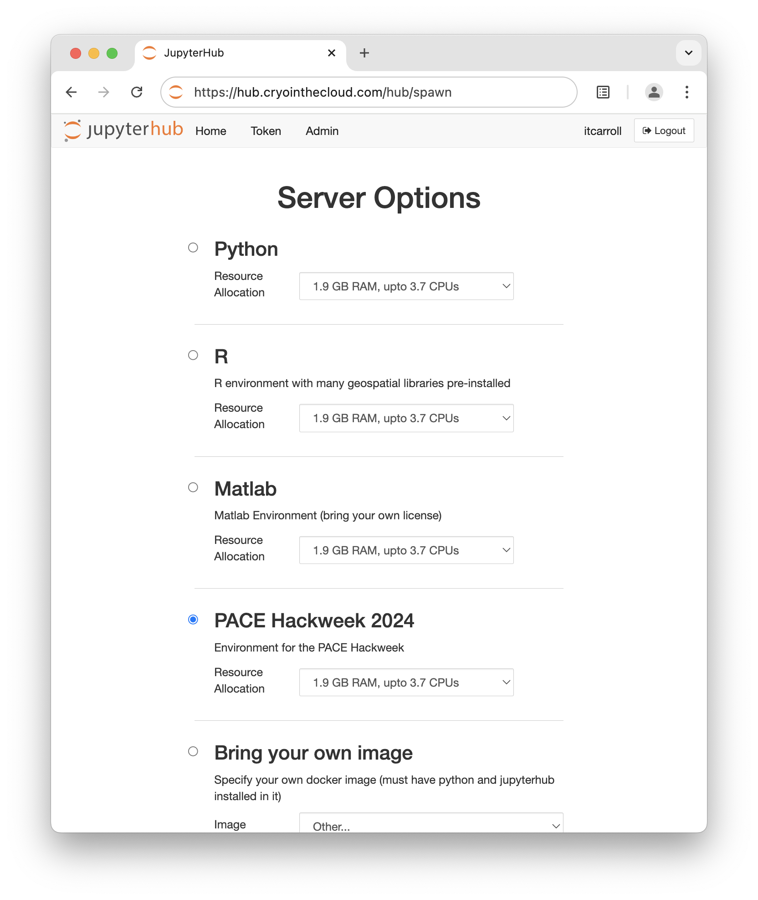
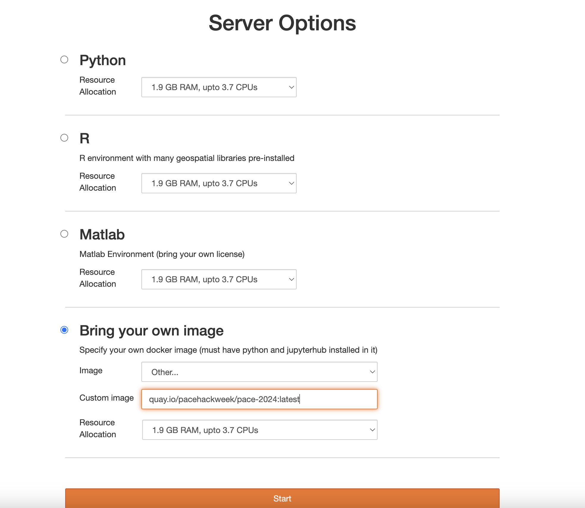

# Checklist
## Required setup

```{attention}
Please make sure to find some time to go through the below material before
the hackweek.

__Here is a checklist of things you need to do in advance__:
<div>
  <input type="checkbox" name="a2">
  <label for="a2">Create an EarthData Login</label>
</div>
<div>
  <input type="checkbox" name="a3">
  <label for="a3">Create a GitHub account</label>
</div>
<div>
  <input type="checkbox" name="a4">
  <label for="a4">Login to the CryoCloud JupyterHub</label>
</div>
<div>
  <input type="checkbox" name="a5">
  <label for="a5">Review material from 2022 PACE course (Optional)</label>
</div>
```

### EarthData Login

Each participant will need an Earthdata login to access NASA data. You will need to know your Earthdata username and password. 
If you do not already have an Earthdata login, then navigate to the Earthdata login [page](https://urs.earthdata.nasa.gov/),
register, and record username and password somewhere for use during the hackweek. 

### GitHub Account

[GitHub](https://github.com/) is a hosting service for [Git](https://icesat-2-2023.hackweek.io/reference/glossary.html#term-Git)
repositories, enabling us to share code across teams in a web environment.
There are two reasons you are required to have a GitHub account for the hackweek:
1. Your GitHub account will give you access to the hackweek cloud computing resources.
2. Project teams will be encouraged to use GitHub to collaborate on code.
If you do not already have a GitHub account, then navigate to [GitHub](https://github.com/), enter your email address and click on the green ‘Sign up for GitHub’ button. 
You will need to answer a few required questions in the following dialogs. Be sure to save your username 
and password somewhere for use during the hackweek.

### CryoCloud JupyterHub

We will be using a web application called a [JupyterHub](https://jupyterhub.readthedocs.io/en/stable/) for the hackweek. 
All that is required is a web browser and a GitHub account for authentication. 
We are partnering with [CryoCloud](https://book.cryointhecloud.com/intro.html), which is a JupyterHub built for NASA Cryosphere and Earth Science communities.
Please follow these instructions which will guide you through gaining access to the CryoCloud. 

1. Fill out this short [Getting Started Survey](https://forms.gle/d8oP1gp9YikS2ixM8) to provide the required credentials and information to get you on the hub. 

2. A day or two after registering, you will receive an invite to the CyroCloudUsers team within the CryoCloud organization on GitHub. This will be an email from GitHub at the email you have linked to your GitHub profile. ***Please accept this invitation within 7 days or it will become invalid.*** Your membership on that GitHub team provides you with access to the CryoCloud. You will be invited to the CryoCloud Slack at the same time.

3. Navigate to the [CryoCloud JupyterHub](https://hub.cryointhecloud.com/) to make sure it works for you. You will need your GitHub username and password to sign on. 

It can take several minutes for new servers to launch on the cloud. Once things are spun up, you will see your very own instance of a JupyterLab environment. 

During the PACE Hackweek, you will see the "PACE Hackweek 2024" option on the "Server Options" page after logging in.



<a id="byo-image"></a>After the Hackweek, that short-cut will be removed. You can continue using the same Docker image if you enter it manually. When you get to "Server Options" page after logging in, select "Bring your own image" option and enter: `quay.io/pacehackweek/pace-2024:latest` into the "Custom image" field.



You will have access to your own virtual drive space under the `/home/jovyan` directory. No other users will be able to see or access your data files. You can add/remove/edit files in your virtual drive space. You will also have access to the `shared` folder (read-only access), and to the *`shared-public`* folder (read and write access). These are shared spaces so please make sure not to delete files from here unless they are yours.

*To save our community money, when you are finished working for the day it is really helpful for you to explicitly stop your server before logging out of your JupyterHub session.* To shut your server down immediately when you’re exiting your session please select “File -> Hub Control Panel -> Stop my Server” then you can click the “Log Out” button. We ask this because when you keep a session active it uses up AWS resources and these resources cost money per hour of use. If you forget this step, though, the server will shut down automatically after 90 min of no use.
Logging out will **NOT** cause any files under `/home/jovyan` to be deleted. It is equivalent to turning off your desktop computer at the end of the day.

4. Add yourself to the CryoCloud #pace_hackweek [Slack channel](https://join.slack.com/t/cryospherecloud/shared_invite/zt-1isgbeuhh-q~cYYKtn_6i3PR1alGca_g) to join the community, get updates, and ask any questions.

### 2022 PACE Course Review (Optional) 

If interested, please review course material from the 2022 PACE training course: *What’s behind the curtain of the NASA PACE mission?* All lecture recordings and presentation PDFs can be accessed [here.](https://www.us-ocb.org/pace-mission-training-activity/)
