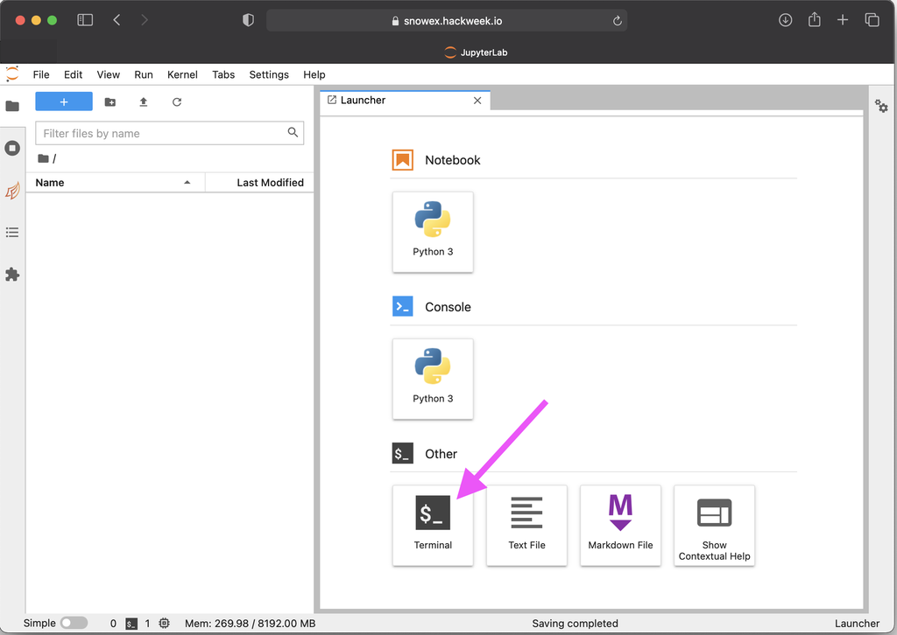

# Setting up `git`

## What is Git?

[Git](https://git-scm.com/) is a version control system that many scientists use
to collaborate on code.

```{note}
You are not required to know Git in advance of this event, but this is a great opportunity to learn all about it!
[Here's a quick introduction video from the official website](https://git-scm.com/video/what-is-git)
```

## Setting up on JupyterHub

Below are instructions to get you setup with `git` on the {{hackweek}}
JupyterHub. These are only basic instructions to get started. See the
[Software Carpentry Git](https://swcarpentry.github.io/git-novice/index.html)
instructions for a thorough explanation and background information.

### 1. Login to JupyterHub

Go to {{ jupyterhub_url }}. See also our JupyterHub documentation: {ref}`accessing-jupyterhub`

### 2. Open a Terminal

Choose the "Terminal" app from the "Other" options in the Launcher.



### 3. Configure Basic `git` Information

Set your name and email address. The `user.name` is your full name, not your "username"
on GitHub or anywhere else. The email address should be one registered on your GitHub account.

```{attention}
Use your own name instead of the placeholder `Attendee Name`
in the below commands. For the email, it should be the address you used to create
your GitHub account instead of `attendee@hackweek.com`. Both values need to be
surrounded by quotes `"`.
```

```shell
$ git config --global user.name "Attendee Name"
$ git config --global user.email "attendee@hackweek.com"
$ git config --global pull.rebase false
```

The third line is a configuration you must set before pulling with git. It specifies
the strategy on how git will apply changes you pull from a remote git repository.
More on strategies is [described here.](http://git-scm.com/book/en/v2/Git-Branching-Rebasing)

To verify that you successfully executed the above commands, use the `git config --list` command
in the Terminal. The output should look similar to this:
```shell
$ git config --list
user.name=Attendee Name
user.email=attendee@hackweek.com
pull.rebase=false
```

### 4. Authenticating with GitHub

In order to interact with GitHub via the `git` command inside the JupyterHub environment,
you need to set up authentication. The two methods below both rely on secure
Personal Access Tokens, which you can learn more about on [GitHub docs][gh-docs].

[gh-docs]:https://docs.github.com/en/authentication/keeping-your-account-and-data-secure/managing-your-personal-access-tokens

#### Option 1: CryoCloud GitHub Access

We recommend this method if you have permission to configure a GitHub App on the user or organization where you
need to authenticate. For instance, if you want to push to `https://github.com/example/repo.git`, then you need to have
permission to configure the settings for `example` (a user or organization).

Start from a Terminal (choose the "Terminal" app from the "Other" options in the Launcher). Follow
the instructions returned by the `gh-scoped-creds` command:

```shell
$ gh-scoped-creds 
You have 15 minutes to go to https://github.com/login/device and enter the code: XXXX-XXXX
Waiting......
```

After you have entered the code and granted authorization, the Terminal will update:

```shell
Success! Authentication will expire in 8.0 hours.

Visit https://github.com/apps/cryocloud-github-access to manage list of repositories you can push to from this location
Tip: Use https:// URLs to clone and push to repos, not ssh URLs!
```

To set up the user or oranization to allow access by the Personal Access Token just created, follow the link provided.

Here is a GIF walking through the workflow. Note that it shows a way to do the same setup in a notebook before
showing the Terminal way just described.


#### Option 2: Manual Configuration

Work through the instructions on the
[GitHub personal access tokens](https://docs.github.com/en/authentication/keeping-your-account-and-data-secure/managing-your-personal-access-tokens#creating-a-personal-access-token-classic)
page. The maximum permissions you likely need is the **repo** scope.


Once you have created your token, be sure to save it or use it before navigating away. It won't be
visible again. To have it saved on CryoCloud the first time you use it, configure the `git` credential helper.

```shell
git config --global credential.helper store
```

To use the Personal Access Token, you need to use `git` to do something that requires authentication, such as
pushing to a repository or cloning a private repository. These actions will prompt
for input of your credentials. When prompted for a password, use the Personal Access Token rather than your
GitHub password.

```{attention}
The prompt for the `Password:` will not show any characters that are entered
and stay blank. Make sure to only copy and paste your token once and then
hit the enter key.
```
